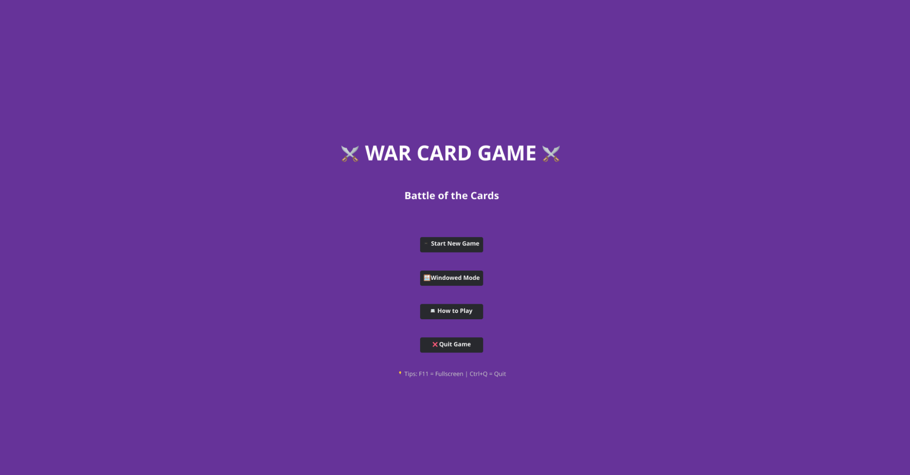
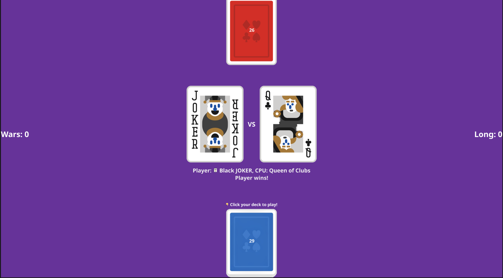

# ⚔️ War Card Game

A modern implementation of the classic War card game built with Go and Fyne, featuring a complete GUI, sound effects, and cross-platform distribution.

## 🎬 CS50x Final Project Video

[](https://youtu.be/U8c8GuNDFkY)

*Click to watch my CS50x final project presentation - see the game in action and learn about the development journey!*

## 📸 Screenshots


*Main menu with dark theme* and professional gaming aesthetic*
*

*Complete game rules with card hierarchy explanation*


*Battle in progress - click your deck to play cards and collect your opponent's!*

## 🎯 About This Project

This project was created as my final project for **CS50x** - my first complete application built from scratch. Having never touched Go before (coming from dabbling in Python and JavaScript), this represents a significant learning journey that taught me:

- **Go fundamentals**: From basic syntax to advanced concepts like goroutines and first-class functions
- **GUI programming**: Using Fyne framework and understanding how it relates to concepts like the DOM
- **Asset management**: Learning about bundled resources for cross-platform distribution
- **Cross-compilation**: Using Zig to compile for different platforms
- **Software distribution**: Creating professional releases for Windows, Linux, and macOS

## 🎮 Game Features

### Core Gameplay
- **Classic War Rules**: Higher card wins, with special war scenarios for ties
- **Enhanced Card Deck**: 52 standard cards + 3 special Jokers (Normal, Red, Black)
- **Visual Feedback**: Card animations, shake effects during wars, and clear result displays
- **Sound Effects**: Card shuffle and play sounds for immersive experience

### User Interface
- **Dark Theme**: Professional gaming aesthetic
- **Fullscreen Support**: F11 toggle and native fullscreen button
- **Responsive Design**: Works across different screen sizes
- **Intuitive Controls**: Click-to-play interface with clear instructions

### Technical Features
- **Single-File Distribution**: All assets bundled into executable
- **Cross-Platform**: Windows, Linux, and macOS support
- **Professional Packaging**: Native app bundles for each platform
- **Efficient Resource Management**: Embedded images and sounds

## 🚀 Quick Start

### Download & Play
1. Go to [Releases](../../releases)
2. Download for your platform:
   - **Windows**: `war-card-game-bundled-windows.exe`
   - **Linux**: `war-card-game-bundled-linux`
   - **macOS**: `war-card-game-mac.dmg`
3. Run the executable - no installation needed!

### Game Rules
- Click your deck to play a card
- Higher value card wins both cards
- **Card Hierarchy** (lowest to highest): 2, 3, 4, 5, 6, 7, 8, 9, 10, Jack, Queen, King, Ace, Normal Joker (15), Red Joker (16), Black Joker (17)
- **War occurs** when both players play the same value - each puts down 4 cards, winner takes all!
- **Victory condition**: Collect all cards to win

### Controls
- **Mouse**: Click your deck to play
- **F11**: Toggle fullscreen
- **Ctrl+Q**: Quit game
- **Native fullscreen**: Use the green button on macOS

## 🛠️ Development & Building

### Prerequisites
```bash
# Go 1.19+
go version

# Fyne CLI tool
go install fyne.io/fyne/v2/cmd/fyne@latest

# For cross-compilation (optional)
# Install Zig from https://ziglang.org/download/
```

### Building from Source
```bash
# Clone the repository
git clone https://github.com/Redsskull/war-card-game.git
cd war-card-game

# Bundle assets (required before building)
./bundle_assets.sh

# Build for current platform
go build -ldflags="-s -w" -o war-card-game

# Or use platform-specific scripts
./build_mac.sh  # Creates .app bundle and .dmg on macOS
```

### Cross-Compilation with Zig
```bash
# Windows (from Linux/macOS)
CGO_ENABLED=1 GOOS=windows GOARCH=amd64 CC="zig cc -target x86_64-windows-gnu" CXX="zig c++ -target x86_64-windows-gnu" go build -ldflags="-s -w" -o war-card-game-windows.exe

# Linux (from other platforms)
CGO_ENABLED=1 GOOS=linux GOARCH=amd64 CC="zig cc -target x86_64-linux-gnu" CXX="zig c++ -target x86_64-linux-gnu" go build -ldflags="-s -w" -o war-card-game-linux
```

## 📚 Learning Journey & Technical Insights

### Key Discoveries Made During Development

**Goroutines for UI Updates**: Learned how to use `fyne.Do()` to safely update the UI from background goroutines, especially crucial for timed animations during war scenarios.

**First-Class Functions in Go**: Discovered how functions can be passed around as values, making button callbacks and event handling elegant and flexible.

**Fyne Framework Understanding**: Realized that Fyne's object model is similar to the DOM in web development - containers hold objects, and everything is structured hierarchically.

**Resource Bundling**: Learned about embedding assets directly into executables using `fyne bundle`, solving cross-platform distribution challenges (especially on macOS).

**Cross-Platform Compilation**: Discovered Zig as a solution for cross-compiling CGO-dependent GUI applications across platforms.

### Code Philosophy

I evolved my commenting approach during this project. Initially following the "only comment why, not what" rule, I realized that as a learner, commenting the "what" and "how" actually:
- Helps me research and understand what I'm trying to accomplish
- Allows AI assistants to better understand my code and provide targeted help
- Creates a learning trail I can follow when revisiting code
- Documents my thought process for future reference

This approach significantly accelerated my learning and made collaboration (even with AI) much more effective.

### Technical Architecture

The game uses a clean separation of concerns:
- **`main.go`**: UI and game flow orchestration
- **`game.go`**: Core game logic and state management
- **`card.go`**, **`deck.go`**, **`player.go`**: Game entity models
- **`sound.go`**: Audio system with embedded MP3 handling
- **`effects.go`**: Visual effects and animations
- **`resource_helper.go`**: Asset management and bundled resource mapping
- **`resources.go`**: Auto-generated embedded assets (6.7MB of images and sounds)

## 🎯 Future Improvements

When time allows, I plan to revisit and enhance:

- [ ] Investigate Mac fullscreen behavior (low priority - current works fine)
- [ ] Add multiplayer support over network
- [ ] Implement different game variants (e.g., Egyptian Ratscrew)
- [ ] Add more visual effects and animations
- [ ] Create a tournament mode
- [ ] Add statistics tracking
- [ ] Implement different difficulty levels for CPU

See [TODO.md](TODO.md) for detailed development notes.

## 🏆 Project Stats

- **Lines of Code**: ~1,200+ lines of Go
- **Assets**: 59 card images + 2 sound files (all bundled)
- **Platforms Supported**: Windows, Linux, macOS
- **Distribution Size**: ~34MB per platform (everything included)
- **Development Time**: Several weeks of evening/weekend coding
- **Learning Curve**: Steep but rewarding!

## 🙏 Acknowledgments

- **CS50x** for providing the foundation and motivation to build something complete
- **Go Community** for excellent documentation and examples
- **Fyne Framework** for making GUI development in Go accessible
- **Card Art**: Beautiful playing card graphics from the [Card Games Graphics Pack](https://ci.itch.io/card-games-graphics-pack?download) - created by talented artists who make game development more beautiful
- **Claude AI** for being an excellent learning companion - helping me find the right documentation, understand concepts, and debug issues while encouraging me to understand the "why" behind solutions

## 📄 License

This project is open source and available under the [MIT License](LICENSE).

## 🎮 Enjoy the Game!

Whether you're here to play or learn from the code, I hope you enjoy this labor of love. It represents countless hours of learning, debugging, and the satisfaction of building something complete from scratch.

*"I learned every day after bashing my head against the wall"* - and that's exactly how real programming skills are built!

---

**Happy Gaming!** ⚔️🎴
